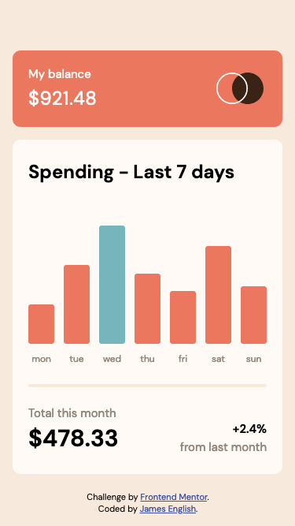
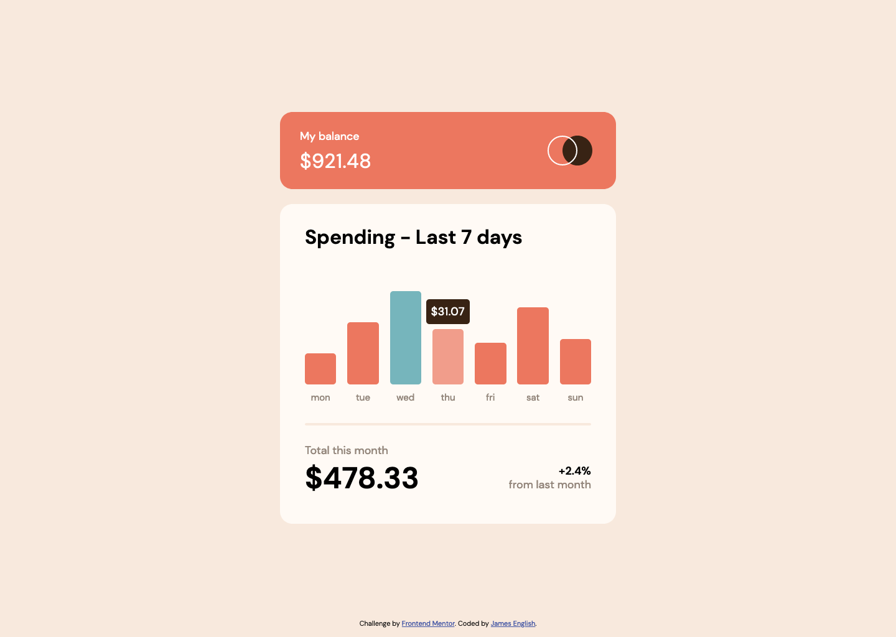

# Frontend Mentor - Expenses chart component solution

This is a solution to the [Expenses chart component challenge on Frontend Mentor](https://www.frontendmentor.io/challenges/expenses-chart-component-e7yJBUdjwt). Frontend Mentor challenges help you improve your coding skills by building realistic projects. 

## Table of contents

- [Overview](#overview)
  - [The challenge](#the-challenge)
  - [Screenshots](#screenshots)
  - [Links](#links)
- [My process](#my-process)
  - [Built with](#built-with)
  - [What I learned](#what-i-learned)
  - [Continued development](#continued-development)
- [Author](#author)

## Overview

### The challenge

Users should be able to:

- View the bar chart and hover over the individual bars to see the correct amounts for each day
- See the current day’s bar highlighted in a different colour to the other bars
    (**Note**: This did not make sense to me, as the display is supposedly the last 7 days of spending, hence the current day would not be in the middle of the graph. I interpreted the highlighted bar as being the bar with the highest spending, and programmed accordingly)
- View the optimal layout for the content depending on their device’s screen size
- See hover states for all interactive elements on the page
- **Bonus**: Use the JSON data file provided to dynamically size the bars on the chart

### Screenshots

### Links

- Solution URL: [Frontend Mentor](https://www.frontendmentor.io/solutions/dynamically-sized-bars-with-error-message-if-data-fails-to-load-9ZheiO9Q_J)
- Live Site URL: [Vercel](https://fem-expenses-chart-component-tau.vercel.app/)

## My process

### Built with

HTML, SCSS and Javascript

### What I learned

Learned a bit about loading external data in Javascript using Fetch.

### Continued development

I want to continue developing front-end capabilities.

## Author

- Codepen - [@anglicus](https://codepen.io/anglicus)
- Frontend Mentor - [@anglicus](https://www.frontendmentor.io/profile/anglicus)
- FreeCodeCamp [@anglicus] (https://www.freecodecamp.org/anglicus)

